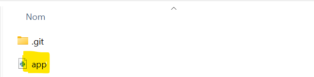
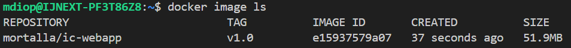
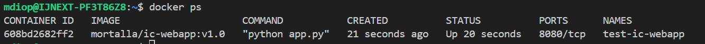
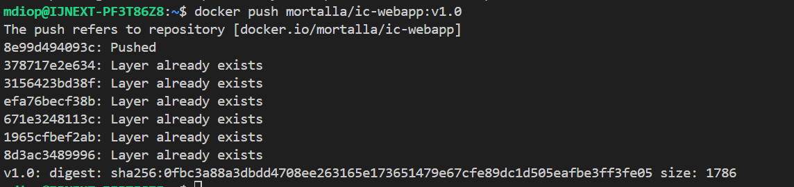
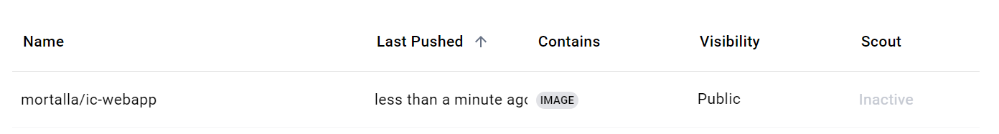

# mini-proj-file-rouge

I. web-app
1/Copie du fichier app

2/Creation du container

 docker build -t mortalla/ic-webapp:v1.0 .

 docker run -d --name=test-ic-webapp mortalla/ic-webapp:v1.0

 

 3/Push to the DockerHub

 docker push mortalla/ic-webapp:v1.0

 

 

 II. Ansible Role

 III. Jenkinsfile Pipeline